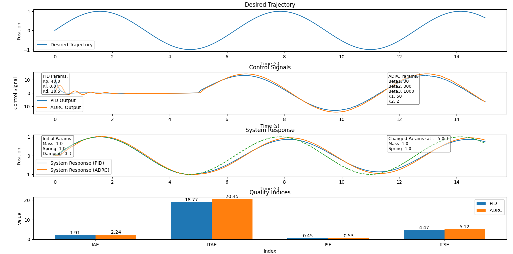
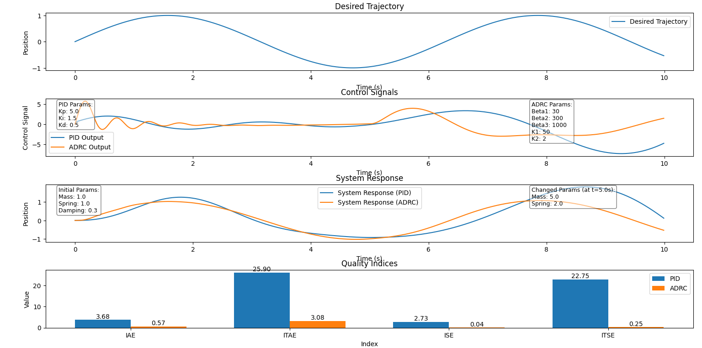
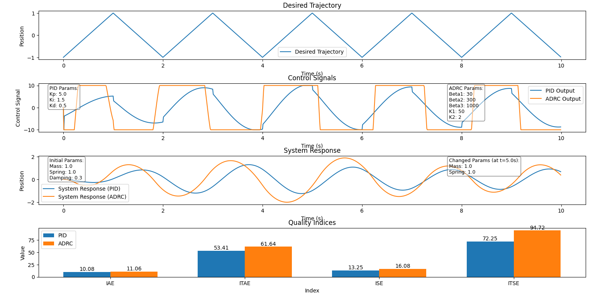
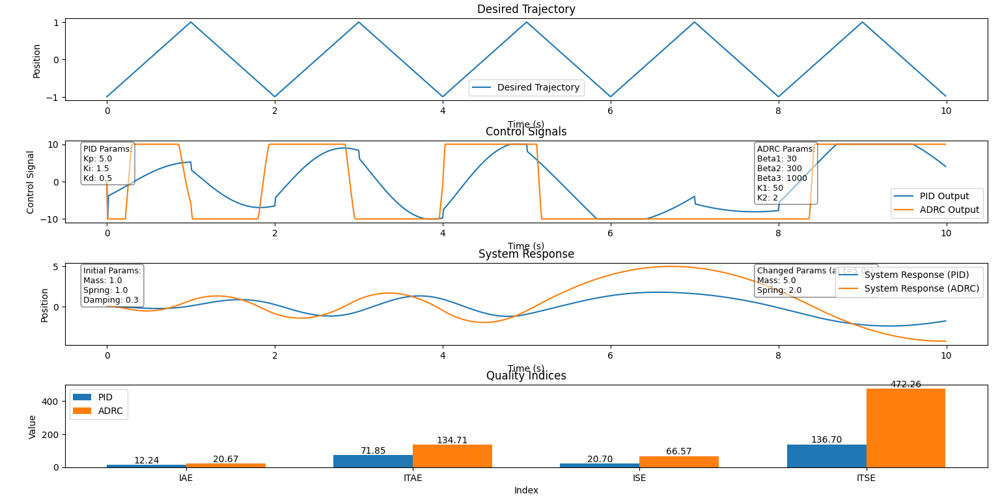
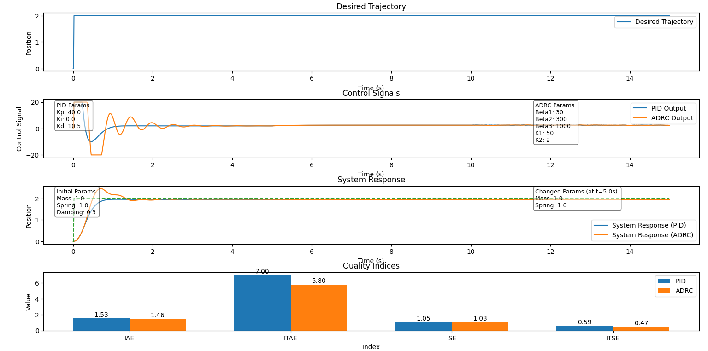
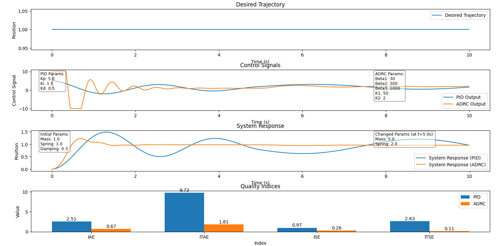

# Porównanie odporności sterowników PID i ADRC

Projekt z przedmiotu Teoria Sterowania w Robotyce. Porównanie odporności sterowników PID i ADRC.

## Opis projektu

W projekcie zaimplementowano obiekt o pewnej masie oraz kilka różnych trajektorii, które można dostosowywać i wybierać według uznania. W trakcie symulacji porównano zachowanie sterowników PID i ADRC zarówno w przypadku stałych własności obiektu, jak i w sytuacji, gdy te własności zmieniają się w połowie symulacji. Wyniki są przedstawione w postaci wykresów, które zawierają trajektorię żądaną, sygnały sterujące oraz odpowiedzi układu.

## Konfigurowalne parametry

- **Konfiguracja trajektorii**: `sin`, `const`, `poly`, `triangle`
- **Nastawy regulatorów**: `kp`, `ki`, `kd` dla PID oraz `beta1`, `beta2`, `beta3`, `k1`, `k2` dla ADRC
- **Początkowe własności obiektu**: masa, stała sprężystości, współczynnik tłumienia
- **Własności obiektu zmienne w czasie**: masa, stała sprężystości zmieniane po określonym czasie

## Struktura projektu

Projekt składa się z dwóch głównych plików: `main.py` i `funkcje.py`.

### main.py

Główny plik projektu, w którym znajduje się konfiguracja parametrów, inicjalizacja trajektorii, sterowników oraz symulacja układu.

#### Fragment kodu - Konfiguracja parametrów:

```python
# Configuration parameters
dt = 0.01
simulation_time = 10
t = np.arange(0, simulation_time, dt)

# Trajectory configuration
trajectory_type = 'const'  # Options: 'sin', 'const', 'poly', 'triangle'
const_value = 1.0  # for 'const'
poly_coefficients = [1, -2, 1]  # for 'poly'
triangle_period = 2  # for 'triangle'
triangle_amplitude = 1  # for 'triangle'

# Controller parameters
pid_params = {'kp': 5.0, 'ki': 1.5, 'kd': 0.5}
adrc_params = {'beta1': 30, 'beta2': 300, 'beta3': 1000, 'k1': 50, 'k2': 2, 'dt': dt}

# Initial system parameters
initial_mass = 1.0
initial_spring_constant = 1.0
initial_damping_coefficient = 0.3

# Changed system parameters
change_time = 5.0
changed_mass = 1.0
changed_spring_constant = 1.0
```

#### Fragment kodu - Pętla symulacji:

```python
# Simulation loop
for i in range(1, len(t)):
    current_time = t[i]
    # Update system parameters if current_time >= change_time
    if current_time >= change_time:
        system_pid.mass = changed_mass
        system_pid.spring_constant = changed_spring_constant
        system_adrc.mass = changed_mass
        system_adrc.spring_constant = changed_spring_constant

    # Get control signals
    pid_control = pid.calculate(trajectory[i], system_pid.position, dt)
    adrc_control = adrc.calculate(trajectory[i], system_adrc.position, dt)

    # Update system dynamics
    system_response_pid[i] = system_pid.update(pid_control, dt, current_time)
    system_response_adrc[i] = system_adrc.update(adrc_control, dt, current_time)

    # Store control outputs
    pid_output[i] = pid_control
    adrc_output[i] = adrc_control
```

### funkcje.py

Plik zawiera wszystkie funkcje używane w `main.py`, w tym generowanie trajektorii, implementację sterowników, symulację układu oraz funkcje do rysowania wyników.

#### Fragment kodu - Implementacja obiektu:

```python
class MassSpringDamper:
    def __init__(self, mass, spring_constant, damping_coefficient):
        self.mass = mass
        self.spring_constant = spring_constant
        self.damping_coefficient = damping_coefficient
        self.position = 0
        self.velocity = 0

    def update(self, force, dt, current_time):
        acceleration = (force - self.spring_constant * self.position
                        - self.damping_coefficient * self.velocity) / self.mass
        self.velocity += acceleration * dt
        self.position += self.velocity * dt
        return self.position
```

#### Fragment kodu - Implementacja sterowników:

```python
class PIDController:
    def __init__(self, kp, ki, kd):
        self.kp = kp
        self.ki = ki
        self.kd = kd
        self.integral = 0
        self.previous_error = 0
        self.min = -10
        self.max = 10

    def calculate(self, setpoint, measured_value, dt):
        error = setpoint - measured_value
        self.integral += error * dt
        derivative = (error - self.previous_error) / dt
        output = self.kp * error + self.ki * self.integral + self.kd * derivative
        self.previous_error = error
        if output > self.max:
            output = self.max
        elif output < self.min:
            output = self.min
        return output

class ESO:
    def __init__(self, beta1, beta2, beta3, dt):
        self.beta1 = beta1
        self.beta2 = beta2
        self.beta3 = beta3
        self.dt = dt
        self.x1_hat = 0.0
        self.x2_hat = 0.0
        self.x3_hat = 0.0

    def update(self, measured_value):
        error = measured_value - self.x1_hat
        self.x1_hat += self.dt * (self.x2_hat + self.beta1 * error)
        self.x2_hat += self.dt * (self.x3_hat + self.beta2 * error)
        self.x3_hat += self.dt * (self.beta3 * error)
        return self.x1_hat, self.x2_hat, self.x3_hat

class ADRCController:
    def __init__(self, beta1, beta2, beta3, k1, k2, dt):
        self.eso = ESO(beta1, beta2, beta3, dt)
        self.k1 = k1
        self.k2 = k2
        self.min = -10
        self.max = 10

    def calculate(self, setpoint, measured_value, dt):
        x1_hat, x2_hat, x3_hat = self.eso.update(measured_value)
        error = setpoint - x1_hat
        control_signal = self.k1 * error - self.k2 * x2_hat - x3_hat
        if control_signal > self.max:
            control_signal = self.max
        elif control_signal < self.min:
            control_signal = self.min
        return control_signal
```

#### Fragment kodu - Implementacja wskaźników jakości:

```python
def calculate_quality_indices(time, trajectory, response):
    error = trajectory - response
    IAE = np.trapz(np.abs(error), time)
    ITAE = np.trapz(time * np.abs(error), time)
    ISE = np.trapz(error ** 2, time)
    ITSE = np.trapz(time * error ** 2, time)
    return IAE, ITAE, ISE, ITSE
```

## Wykresy wyników

### Trajektoria sinusoidalna (bez zmiany parametrów)


### Trajektoria sinusoidalna (ze zmianą parametrów)


### Trajektoria trójkątna (bez zmiany parametrów)


### Trajektoria trójkątna (ze zmianą parametrów)


### Trajektoria stała (bez zmiany parametrów)


### Trajektoria stała (ze zmianą parametrów)


