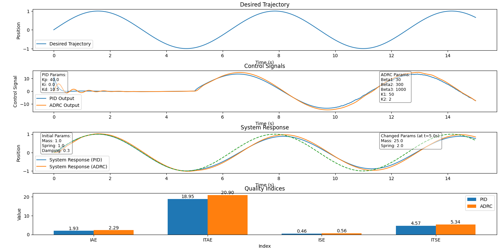
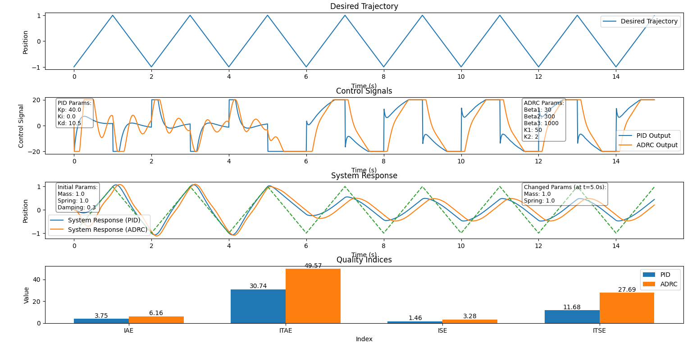
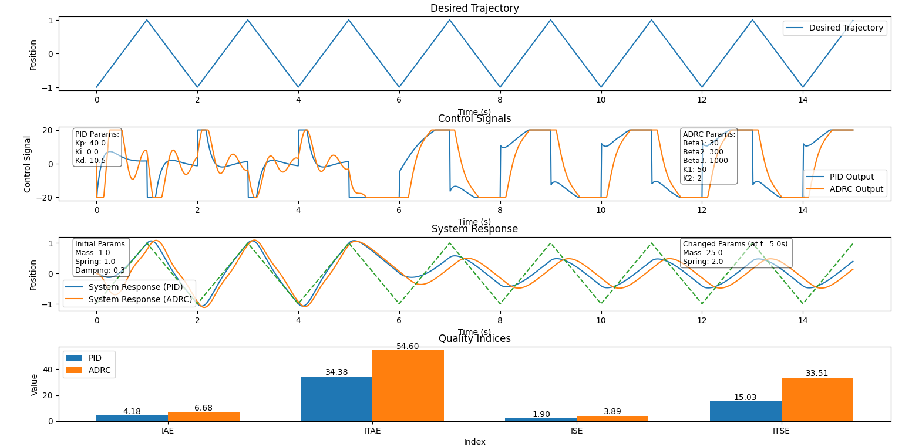
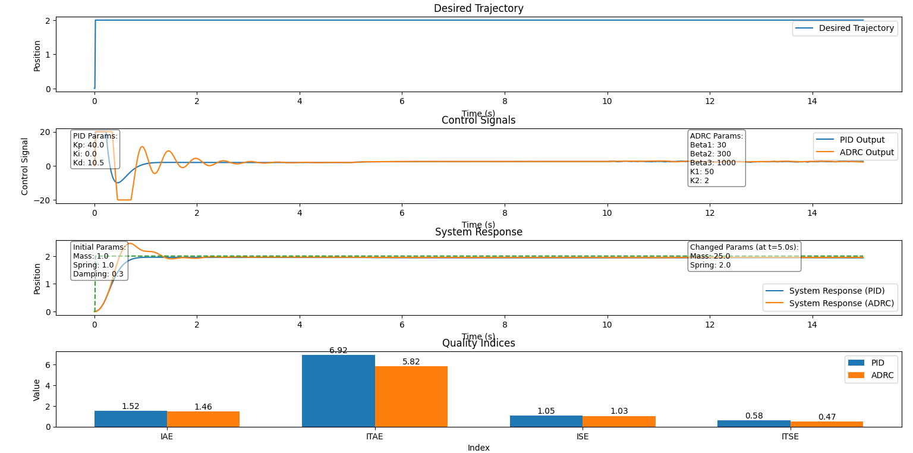

#### ======= ENGLISH BELOW =======

# Porównanie odporności sterowników PID i ADRC

Projekt z przedmiotu Teoria Sterowania w Robotyce. Porównanie odporności sterowników PID i ADRC.

## Opis projektu

W projekcie zaimplementowano obiekt o pewnej masie oraz kilka różnych trajektorii, które można dostosowywać i wybierać według uznania. W trakcie symulacji porównano zachowanie sterowników PID i ADRC zarówno w przypadku stałych własności obiektu, jak i w sytuacji, gdy te własności zmieniają się w połowie symulacji. Wyniki są przedstawione w postaci wykresów, które zawierają trajektorię żądaną, sygnały sterujące oraz odpowiedzi układu.

## Konfigurowalne parametry

- **Konfiguracja trajektorii**: `sin`, `const`, `poly`, `triangle`
- **Nastawy regulatorów**: `kp`, `ki`, `kd` dla PID oraz `beta1`, `beta2`, `beta3`, `k1`, `k2` dla ADRC
- **Początkowe własności obiektu**: masa, stała sprężystości, współczynnik tłumienia
- **Własności obiektu zmienne w czasie**: masa, stała sprężystości zmieniane po określonym czasie

## Struktura projektu

Projekt składa się z dwóch głównych plików: `main.py` i `funkcje.py`.

### main.py

Główny plik projektu, w którym znajduje się konfiguracja parametrów, inicjalizacja trajektorii, sterowników oraz symulacja układu.

#### Konfiguracja parametrów:

```python
# Configuration parameters
dt = 0.01
simulation_time = 10
t = np.arange(0, simulation_time, dt)

# Trajectory configuration
trajectory_type = 'const'  # Options: 'sin', 'const', 'poly', 'triangle'
const_value = 1.0  # for 'const'
poly_coefficients = [1, -2, 1]  # for 'poly'
triangle_period = 2  # for 'triangle'
triangle_amplitude = 1  # for 'triangle'

# Controller parameters
pid_params = {'kp': 5.0, 'ki': 1.5, 'kd': 0.5}
adrc_params = {'beta1': 30, 'beta2': 300, 'beta3': 1000, 'k1': 50, 'k2': 2, 'dt': dt}

# Initial system parameters
initial_mass = 1.0
initial_spring_constant = 1.0
initial_damping_coefficient = 0.3

# Changed system parameters
change_time = 5.0
changed_mass = 1.0
changed_spring_constant = 1.0
```

#### Pętla symulacji:

```python
# Simulation loop
for i in range(1, len(t)):
    current_time = t[i]
    # Update system parameters if current_time >= change_time
    if current_time >= change_time:
        system_pid.mass = changed_mass
        system_pid.spring_constant = changed_spring_constant
        system_adrc.mass = changed_mass
        system_adrc.spring_constant = changed_spring_constant

    # Get control signals
    pid_control = pid.calculate(trajectory[i], system_pid.position, dt)
    adrc_control = adrc.calculate(trajectory[i], system_adrc.position, dt)

    # Update system dynamics
    system_response_pid[i] = system_pid.update(pid_control, dt, current_time)
    system_response_adrc[i] = system_adrc.update(adrc_control, dt, current_time)

    # Store control outputs
    pid_output[i] = pid_control
    adrc_output[i] = adrc_control
```

### funkcje.py

Plik zawiera wszystkie funkcje używane w `main.py`, w tym generowanie trajektorii, implementację sterowników, symulację układu oraz funkcje do rysowania wyników.

#### Implementacja obiektu:

```python
class MassSpringDamper:
    def __init__(self, mass, spring_constant, damping_coefficient):
        self.mass = mass
        self.spring_constant = spring_constant
        self.damping_coefficient = damping_coefficient
        self.position = 0
        self.velocity = 0

    def update(self, force, dt, current_time):
        acceleration = (force - self.spring_constant * self.position
                        - self.damping_coefficient * self.velocity) / self.mass
        self.velocity += acceleration * dt
        self.position += self.velocity * dt
        return self.position
```

#### Implementacja sterowników:

```python
class PIDController:
    def __init__(self, kp, ki, kd):
        self.kp = kp
        self.ki = ki
        self.kd = kd
        self.integral = 0
        self.previous_error = 0
        self.min = -10
        self.max = 10

    def calculate(self, setpoint, measured_value, dt):
        error = setpoint - measured_value
        self.integral += error * dt
        derivative = (error - self.previous_error) / dt
        output = self.kp * error + self.ki * self.integral + self.kd * derivative
        self.previous_error = error
        if output > self.max:
            output = self.max
        elif output < self.min:
            output = self.min
        return output

class ESO:
    def __init__(self, beta1, beta2, beta3, dt):
        self.beta1 = beta1
        self.beta2 = beta2
        self.beta3 = beta3
        self.dt = dt
        self.x1_hat = 0.0
        self.x2_hat = 0.0
        self.x3_hat = 0.0

    def update(self, measured_value):
        error = measured_value - self.x1_hat
        self.x1_hat += self.dt * (self.x2_hat + self.beta1 * error)
        self.x2_hat += self.dt * (self.x3_hat + self.beta2 * error)
        self.x3_hat += self.dt * (self.beta3 * error)
        return self.x1_hat, self.x2_hat, self.x3_hat

class ADRCController:
    def __init__(self, beta1, beta2, beta3, k1, k2, dt):
        self.eso = ESO(beta1, beta2, beta3, dt)
        self.k1 = k1
        self.k2 = k2
        self.min = -10
        self.max = 10

    def calculate(self, setpoint, measured_value, dt):
        x1_hat, x2_hat, x3_hat = self.eso.update(measured_value)
        error = setpoint - x1_hat
        control_signal = self.k1 * error - self.k2 * x2_hat - x3_hat
        if control_signal > self.max:
            control_signal = self.max
        elif control_signal < self.min:
            control_signal = self.min
        return control_signal
```

#### Implementacja wskaźników jakości:

```python
def calculate_quality_indices(time, trajectory, response):
    error = trajectory - response
    IAE = np.trapz(np.abs(error), time)
    ITAE = np.trapz(time * np.abs(error), time)
    ISE = np.trapz(error ** 2, time)
    ITSE = np.trapz(time * error ** 2, time)
    return IAE, ITAE, ISE, ITSE
```

### Jak Uruchomić

1. Upewnij się, że masz zainstalowany Python 3.11.
2. Zainstaluj wymagane biblioteki używając `pip install -r requirements.txt`.
3. Ustaw wirtualne środowisko i aktywuj je.
4. Uruchom skrypt `main.py`.

## Wykresy wyników

### Trajektoria sinusoidalna (bez zmiany parametrów)


### Trajektoria sinusoidalna (ze zmianą parametrów)


### Trajektoria trójkątna (bez zmiany parametrów)


### Trajektoria trójkątna (ze zmianą parametrów)


### Trajektoria stała (bez zmiany parametrów)


### Trajektoria stała (ze zmianą parametrów)


### Podsumowanie

Wyniki symulacji pokazują, że sterownik ADRC jest wyraźnie bardziej odporny na zakłócenia i zmiany w parametrach obiektu w porównaniu do klasycznego sterownika PID. Sterownik ADRC lepiej reaguje na dynamiczne odchylenia już w trakcie swojego działania, co sprawia, że jest bardziej efektywny w utrzymaniu zadanej trajektorii nawet w trudnych warunkach. Porównanie wskaźników jakości dla różnych trajektorii i zmian parametrów obiektu potwierdza wyższość sterownika ADRC pod względem precyzji i stabilności odpowiedzi systemu.

#
#

#### ======= ENGLISH VERSION =======

# Comparison of PID and ADRC Controllers Robustness

Project for the Control Theory in Robotics course. Comparison of the robustness of PID and ADRC controllers.

## Project Description

The project implements an object with a certain mass and several different trajectories that can be adjusted and selected as desired. The behavior of PID and ADRC controllers is compared during the simulation, both in the case of constant object properties and when these properties change halfway through the simulation. The results are presented in the form of plots, which include the desired trajectory, control signals, and system responses.

## Configurable Parameters

- **Trajectory configuration**: `sin`, `const`, `poly`, `triangle`
- **Controller settings**: `kp`, `ki`, `kd` for PID and `beta1`, `beta2`, `beta3`, `k1`, `k2` for ADRC
- **Initial object properties**: mass, spring constant, damping coefficient
- **Time-varying object properties**: mass, spring constant changed after a specified time

## Project Structure

The project consists of two main files: `main.py` and `funkcje.py`.

### main.py

The main file of the project, which includes the configuration of parameters, initialization of trajectories, controllers, and system simulation.

#### Parameter Configuration:

```python
# Configuration parameters
dt = 0.01
simulation_time = 10
t = np.arange(0, simulation_time, dt)

# Trajectory configuration
trajectory_type = 'const'  # Options: 'sin', 'const', 'poly', 'triangle'
const_value = 1.0  # for 'const'
poly_coefficients = [1, -2, 1]  # for 'poly'
triangle_period = 2  # for 'triangle'
triangle_amplitude = 1  # for 'triangle'

# Controller parameters
pid_params = {'kp': 5.0, 'ki': 1.5, 'kd': 0.5}
adrc_params = {'beta1': 30, 'beta2': 300, 'beta3': 1000, 'k1': 50, 'k2': 2, 'dt': dt}

# Initial system parameters
initial_mass = 1.0
initial_spring_constant = 1.0
initial_damping_coefficient = 0.3

# Changed system parameters
change_time = 5.0
changed_mass = 1.0
changed_spring_constant = 1.0
```

#### Simulation Loop:

```python
# Simulation loop
for i in range(1, len(t)):
    current_time = t[i]
    # Update system parameters if current_time >= change_time
    if current_time >= change_time:
        system_pid.mass = changed_mass
        system_pid.spring_constant = changed_spring_constant
        system_adrc.mass = changed_mass
        system_adrc.spring_constant = changed_spring_constant

    # Get control signals
    pid_control = pid.calculate(trajectory[i], system_pid.position, dt)
    adrc_control = adrc.calculate(trajectory[i], system_adrc.position, dt)

    # Update system dynamics
    system_response_pid[i] = system_pid.update(pid_control, dt, current_time)
    system_response_adrc[i] = system_adrc.update(adrc_control, dt, current_time)

    # Store control outputs
    pid_output[i] = pid_control
    adrc_output[i] = adrc_control
```

### funkcje.py

This file contains all the functions used in `main.py`, including trajectory generation, controller implementation, system simulation, and functions for plotting the results.

#### Object Implementation:

```python
class MassSpringDamper:
    def __init__(self, mass, spring_constant, damping_coefficient):
        self.mass = mass
        self.spring_constant = spring_constant
        self.damping_coefficient = damping_coefficient
        self.position = 0
        self.velocity = 0

    def update(self, force, dt, current_time):
        acceleration = (force - self.spring_constant * self.position
                        - self.damping_coefficient * self.velocity) / self.mass
        self.velocity += acceleration * dt
        self.position += self.velocity * dt
        return self.position
```

#### Controller Implementation:

```python
class PIDController:
    def __init__(self, kp, ki, kd):
        self.kp = kp
        self.ki = ki
        self.kd = kd
        self.integral = 0
        self.previous_error = 0
        self.min = -10
        self.max = 10

    def calculate(self, setpoint, measured_value, dt):
        error = setpoint - measured_value
        self.integral += error * dt
        derivative = (error - self.previous_error) / dt
        output = self.kp * error + self.ki * self.integral + self.kd * derivative
        self.previous_error = error
        if output > self.max:
            output = self.max
        elif output < self.min:
            output = self.min
        return output

class ESO:
    def __init__(self, beta1, beta2, beta3, dt):
        self.beta1 = beta1
        self.beta2 = beta2
        self.beta3 = beta3
        self.dt = dt
        self.x1_hat = 0.0
        self.x2_hat = 0.0
        self.x3_hat = 0.0

    def update(self, measured_value):
        error = measured_value - self.x1_hat
        self.x1_hat += self.dt * (self.x2_hat + self.beta1 * error)
        self.x2_hat += self.dt * (self.x3_hat + self.beta2 * error)
        self.x3_hat += self.dt * (self.beta3 * error)
        return self.x1_hat, self.x2_hat, self.x3_hat

class ADRCController:
    def __init__(self, beta1, beta2, beta3, k1, k2, dt):
        self.eso = ESO(beta1, beta2, beta3, dt)
        self.k1 = k1
        self.k2 = k2
        self.min = -10
        self.max = 10

    def calculate(self, setpoint, measured_value, dt):
        x1_hat, x2_hat, x3_hat = self.eso.update(measured_value)
        error = setpoint - x1_hat
        control_signal = self.k1 * error - self.k2 * x2_hat - x3_hat
        if control_signal > self.max:
            control_signal = self.max
        elif control_signal < self.min:
            control_signal = self.min
        return control_signal
```

#### Quality Indices Implementation:

```python
def calculate_quality_indices(time, trajectory, response):
    error = trajectory - response
    IAE = np.trapz(np.abs(error), time)
    ITAE = np.trapz(time * np.abs(error), time)
    ISE = np.trapz(error ** 2, time)
    ITSE = np.trapz(time * error ** 2, time)
    return IAE, ITAE, ISE, ITSE
```
### How to Run

1. Make sure you have Python 3.11 installed.
2. Install the required libraries using `pip install -r requirements.txt`.
3. Set up a virtual environment and activate it.
4. Run the `main.py` script.

## Result Plots

### Sinusoidal Trajectory (without parameter change)


### Sinusoidal Trajectory (with parameter change)


### Triangle Trajectory (without parameter change)


### Triangle Trajectory (with parameter change)


### Constant Trajectory (without parameter change)


### Constant Trajectory (with parameter change)


### Summary

The simulation results show that the ADRC controller is significantly more robust to disturbances and changes in object parameters compared to the classic PID controller. The ADRC controller responds better to dynamic deviations during its operation, making it more effective in maintaining the desired trajectory even under challenging conditions. Comparing the quality indices for different trajectories and changes in object parameters confirms the superiority of the ADRC controller in terms of precision and stability of the system response.